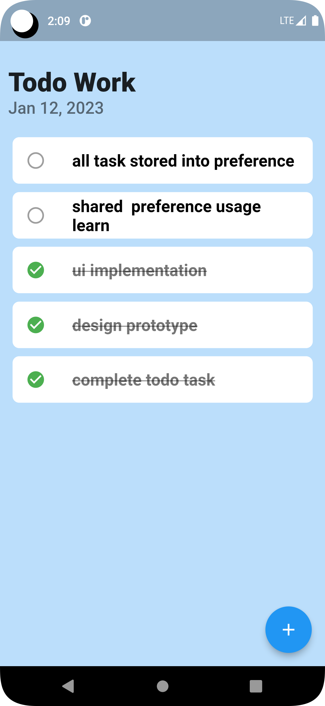

# FlutterTodoAPP
Daily Task todo maintain purpose i tried. if you want clone or fork it. 

## Todo:
- [x] 1. basic concept (add task, list task using listview builder)
- [x] 2. completed and not completed task highlight
- [ ] 3. store all task using shared preference

## FrameWork
1. Flutter

## Language:
1. Dart

## Tools:
1. Git
2. Android studio / Vscode

## Pre-requirement:
1. Flutter 3.3.10
2. Dart 2.18.6
3. shared_preferences 2.0.15

# Cli command
## check your flutter support info:

```
flutter doctor
```
## dependancy install / package install:
```
flutter pub get
```
## Run methods:
```
flutter run
```
### ✌&ensp;Preview

|           Image Preview            |             Gif Preview             |
|:----------------------------------:|:-----------------------------------:|
|  |  |
